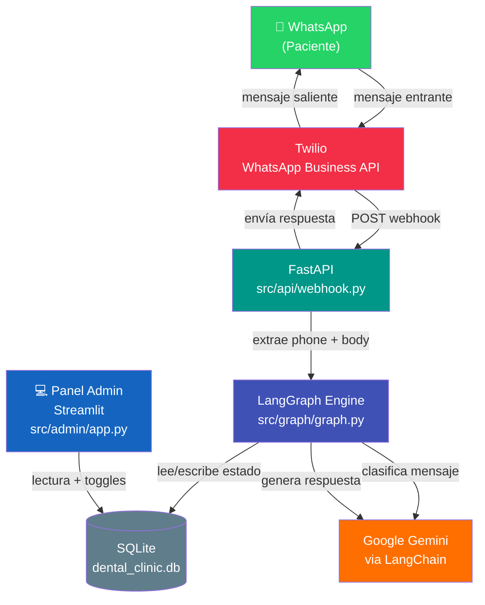
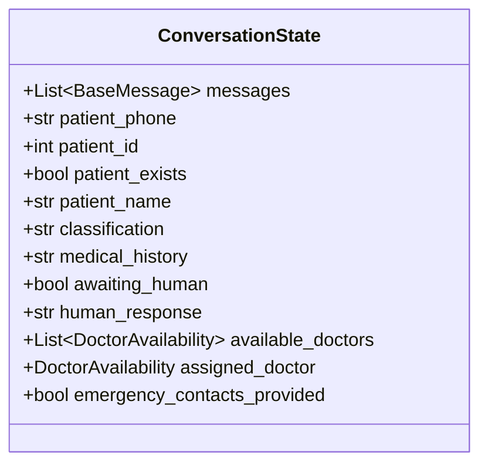
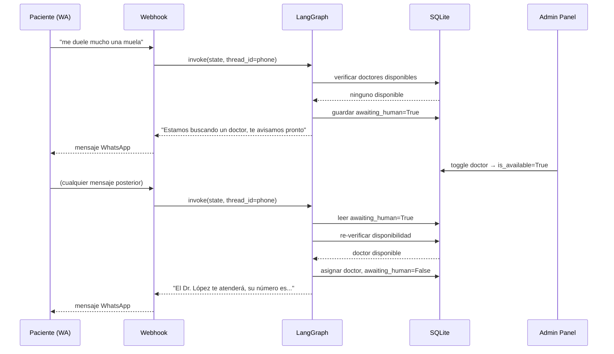
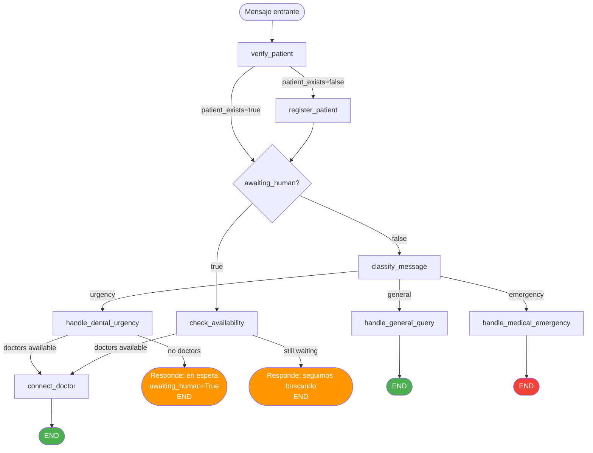
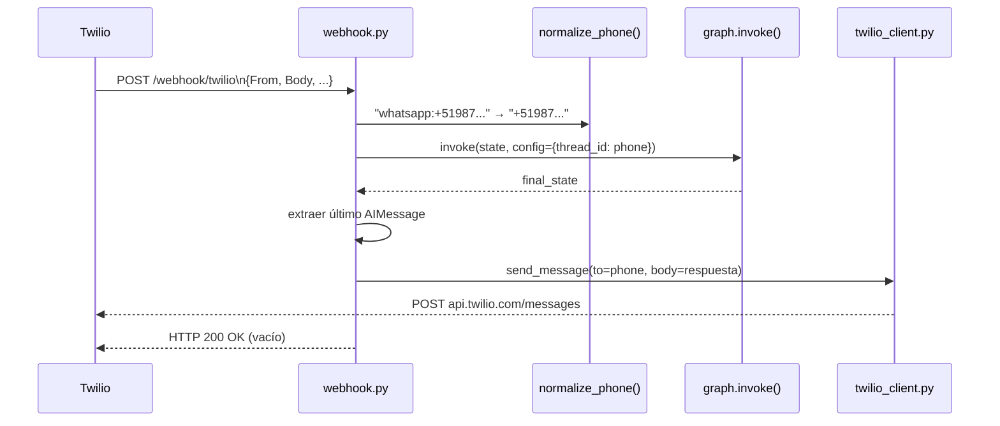
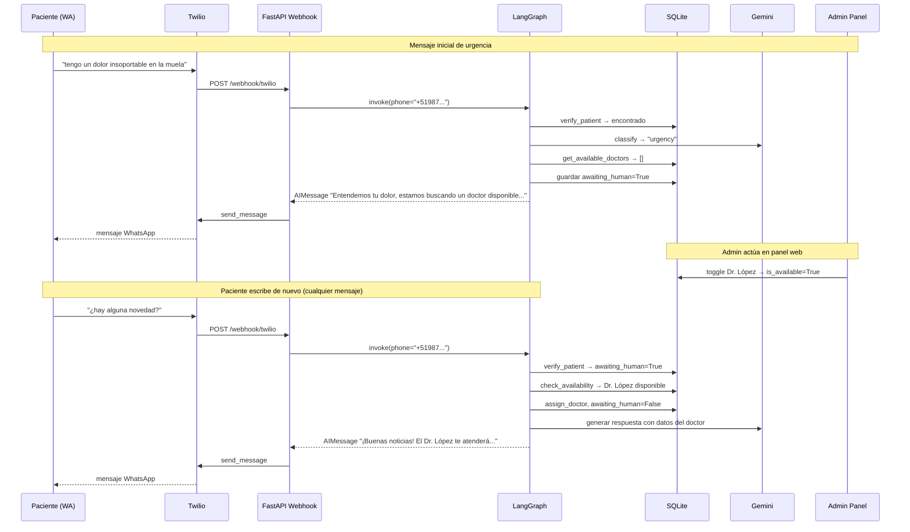
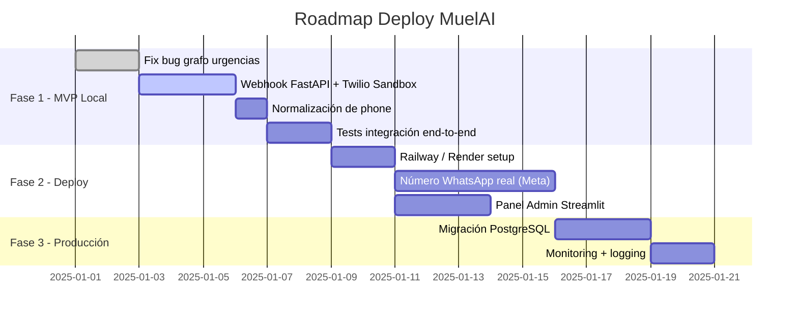

# MuelAI — Sistema de Triage Dental por WhatsApp
### Diseño de Sistema v2.0

---

## 1. Visión General

MuelAI es un asistente conversacional de triage odontológico que opera nativamente en **WhatsApp** como canal principal de atención al paciente, complementado por un **panel web** para el odontólogo/administrador.

### Stack tecnológico

| Capa | Tecnología |
|---|---|
| Canal paciente | WhatsApp Business API via Twilio |
| API Gateway | FastAPI + Uvicorn |
| Orquestación conversacional | LangGraph |
| LLM | Google Gemini (via LangChain) |
| Panel admin | Streamlit (solo lectura + toggles) |
| Persistencia | SQLAlchemy + SQLite (→ PostgreSQL en producción) |
| Deploy | Railway / Render (HTTPS requerido por Twilio) |

### Filosofía de diseño

- **WhatsApp-first**: el paciente no instala nada, no crea cuenta, escribe desde donde ya está.
- **Stateless webhook**: cada mensaje entrante es un evento independiente; el estado vive en la DB, no en memoria.
- **Grafo determinista**: LangGraph orquesta el flujo; los nodos son funciones puras que leen/escriben estado.
- **Sin `interrupt` bloqueante**: el modelo de urgencias se resuelve con estado persistido, no con pausa de ejecución.

---

## 2. Arquitectura de Alto Nivel



---

## 3. Estructura de Carpetas

```
MuelAI/
├── src/
│   ├── api/                        ← NUEVO: reemplaza main.py como entry point
│   │   ├── __init__.py
│   │   ├── webhook.py              ← endpoint POST /webhook/twilio
│   │   └── twilio_client.py        ← wrapper para enviar mensajes via Twilio
│   │
│   ├── admin/                      ← NUEVO: Streamlit reducido (panel odontólogo)
│   │   ├── __init__.py
│   │   └── app.py                  ← dashboard: pacientes, historial, disponibilidad
│   │
│   ├── graph/
│   │   ├── state.py                ← ConversationState (sin cambios estructurales)
│   │   ├── nodes.py                ← lógica de nodos (ajuste en urgencias)
│   │   ├── edges.py                ← enrutamiento condicional (bug fix)
│   │   └── graph.py                ← ensamblaje del StateGraph (bug fix interrupt)
│   │
│   ├── agents/
│   │   ├── classifier.py           ← sin cambios
│   │   ├── responder.py            ← sin cambios
│   │   └── prompts.py              ← sin cambios
│   │
│   ├── services/
│   │   ├── patient_service.py      ← sin cambios
│   │   └── doctor_service.py       ← sin cambios
│   │
│   ├── database/
│   │   ├── models.py               ← sin cambios
│   │   └── connection.py           ← sin cambios
│   │
│   ├── schemas/
│   │   └── models.py               ← + TwilioInboundPayload
│   │
│   └── settings.py                 ← + twilio_account_sid, twilio_auth_token, twilio_phone
│
├── main.py                         ← NUEVO: entrypoint uvicorn (antes era src/main.py Streamlit)
├── pyproject.toml
├── requirements.txt
└── .env
```

> **Lo que se mantiene intacto:** `agents/`, `services/`, `database/`, y la mayor parte de `graph/`.
> **Lo que cambia:** `src/main.py` (Streamlit chat) → `src/api/webhook.py` (FastAPI webhook).

---

## 4. Modelo de Datos

### 4.1 Entidades SQLAlchemy (sin cambios de esquema)

```mermaid
erDiagram
    PATIENT ||--o{ MEDICAL_HISTORY : has
    PATIENT {
        int id PK
        string name
        string phone UNIQUE "Ej: +51987654321"
        string email UNIQUE nullable
        datetime created_at
    }
    MEDICAL_HISTORY {
        int id PK
        int patient_id FK
        datetime date
        string diagnosis
        text treatment
        text notes nullable
    }
    DOCTOR {
        int id PK
        string name
        string specialty
        string phone
        bool is_available
        string current_chat_id nullable "= phone del paciente activo"
    }
```

### 4.2 Identificación del paciente por WhatsApp

Twilio entrega el número del remitente con el prefijo `whatsapp:`. Se normaliza antes de consultar la DB:

```
"whatsapp:+51987654321"  →  "+51987654321"  →  patient.phone
```

El `phone` ya existe como campo único en `Patient` — es el identificador natural del paciente en WhatsApp, sin necesidad de campos adicionales.

---

## 5. Estado Conversacional (LangGraph)

El `thread_id` de LangGraph es igual al `phone` del paciente. Esto garantiza que cada número de WhatsApp tenga su propio hilo de conversación persistido.



### Cambio clave v2: `awaiting_human` sin `interrupt`

En v1 (Streamlit), `interrupt` de LangGraph pausaba la UI hasta que el admin actuaba.
En v2 (WhatsApp), ese mecanismo **no aplica** — el webhook es stateless.

El nuevo modelo:



---

## 6. Flujo del Grafo (v2 corregido)

### 6.1 Nodos

| Nodo | Responsabilidad |
|---|---|
| `verify_patient` | Busca paciente por phone normalizado |
| `register_patient` | Crea paciente nuevo si no existe |
| `classify_message` | Clasifica el último mensaje humano con Gemini |
| `handle_general_query` | Consulta historial y responde (flujo normal) |
| `handle_dental_urgency` | Revisa disponibilidad; si no hay doctor, setea `awaiting_human=True` |
| `check_availability` | Re-verifica disponibilidad en mensajes posteriores cuando `awaiting_human=True` |
| `connect_doctor` | Asigna doctor disponible al estado |
| `handle_medical_emergency` | Responde con contactos de emergencia, finaliza |

### 6.2 Diagrama de Flujo



### 6.3 Bug fix: `route_after_urgency_check`

En v1, el mapeo de `check_availability` incluía la clave `end_conversation` que la función de routing nunca devolvía. El fix alinea las claves del `add_conditional_edges` con los valores reales que retorna la función:

```python
# ANTES (roto)
graph.add_conditional_edges(
    "check_availability",
    route_after_urgency_check,
    {
        "connect_doctor": "connect_doctor",
        "end_conversation": END,       # ← esta clave nunca se devuelve
    }
)

# DESPUÉS (corregido)
graph.add_conditional_edges(
    "check_availability",
    route_after_urgency_check,
    {
        "connect_doctor": "connect_doctor",
        "still_waiting": END,          # ← alineado con el return de la función
    }
)
```

---

## 7. Capa API (Nueva)

### 7.1 Webhook FastAPI

`src/api/webhook.py` recibe los eventos de Twilio y orquesta la invocación del grafo.



**Importante:** Twilio espera un `200 OK` inmediato. La respuesta al paciente se envía por API (no por TwiML en el response body), lo que permite procesar sin timeouts.

### 7.2 Schema del payload Twilio

```python
# src/schemas/models.py
class TwilioInboundPayload(BaseModel):
    From: str          # "whatsapp:+51987654321"
    Body: str          # texto del mensaje
    To: str            # número Twilio
    MessageSid: str    # ID único del mensaje
    AccountSid: str
```

---

## 8. Panel Admin (Streamlit reducido)

`src/admin/app.py` reemplaza el chat de Streamlit con un dashboard de gestión:

```mermaid
flowchart LR
    subgraph Admin Panel
        A[Sidebar\nEstado doctores\nToggle disponibilidad] 
        B[Tab: Pacientes\nLista + búsqueda]
        C[Tab: Historial\nRegistros clínicos]
        D[Tab: Conversaciones activas\nawaiting_human=True]
    end
    Admin Panel --> DB[(SQLite)]
```

**Funcionalidades:**

- Ver lista de pacientes registrados vía WhatsApp
- Consultar historial médico por paciente
- Toggle de disponibilidad de doctores (acción más crítica)
- Ver pacientes en espera (`awaiting_human=True`) para priorizar atención
- No maneja chat en tiempo real (eso es WhatsApp)

---

## 9. Configuración y Variables de Entorno

```python
# src/settings.py
class Settings(BaseSettings):
    # LLM
    google_api_key: str
    gemini_model: str = "gemini-1.5-flash"

    # DB
    database_url: str = "sqlite:///./dental_clinic.db"

    # Twilio (NUEVO)
    twilio_account_sid: str
    twilio_auth_token: str
    twilio_phone_number: str   # "whatsapp:+14155238886" (Sandbox) o número real

    model_config = SettingsConfigDict(env_file=".env")
```

```bash
# .env
GOOGLE_API_KEY=...
TWILIO_ACCOUNT_SID=AC...
TWILIO_AUTH_TOKEN=...
TWILIO_PHONE_NUMBER=whatsapp:+14155238886
DATABASE_URL=sqlite:///./dental_clinic.db
```

---

## 10. Dependencias Nuevas

```txt
# requirements.txt — agregar:
fastapi>=0.111.0
uvicorn[standard]>=0.29.0
twilio>=9.0.0
python-multipart>=0.0.9     # para Form data del webhook Twilio
```

---

## 11. Diagrama de Secuencia Completo — Flujo de Urgencia



---

## 12. Deploy

### Requisitos mínimos

- **HTTPS público**: Twilio requiere un endpoint HTTPS para el webhook. En desarrollo se usa `ngrok`.
- **Persistencia de DB**: Railway y Render permiten volúmenes persistentes para SQLite. Para producción real, migrar a PostgreSQL.

### Entrypoints

```bash
# API (producción/desarrollo)
uvicorn main:app --host 0.0.0.0 --port 8000

# Panel Admin (puerto separado)
streamlit run src/admin/app.py --server.port 8501

# Túnel local para desarrollo
ngrok http 8000
# Configurar en Twilio Sandbox: https://xxxx.ngrok.io/webhook/twilio
```

### Roadmap de deploy



---

## 13. Agentes LLM y Prompts (sin cambios)

| Agente | Modelo | Temperatura | Propósito |
|---|---|---|---|
| `MessageClassifier` | Gemini | 0.0 | Clasifica en `general / urgency / emergency` |
| `DentalResponder` | Gemini | 0.7 | Genera respuestas contextualizadas |

Los prompts en `src/agents/prompts.py` no requieren cambios — son agnósticos al canal.

---

## 14. Puntos Técnicos a Revisar

| # | Problema | Solución |
|---|---|---|
| 1 | `interrupt` de LangGraph bloquea en contexto webhook stateless | Eliminar `interrupt`; usar `awaiting_human` en estado + re-invocación en siguiente mensaje |
| 2 | `route_after_urgency_check` devuelve claves distintas al mapeo del grafo | Alinear claves del `add_conditional_edges` con valores reales de la función |
| 3 | `should_continue_urgency_loop` definido en `edges.py` pero no conectado al grafo | Evaluar si se reutiliza en el nuevo flujo o se elimina |
| 4 | `patient_phone` llegaba desde la UI; ahora viene del header `From` de Twilio | Normalizar `"whatsapp:+51..."` → `"+51..."` en el webhook antes de pasar al grafo |
| 5 | Streamlit manejaba sesión en memoria; ahora el estado debe ser 100% persistido | Verificar que LangGraph checkpointer guarda estado entre invocaciones |

---

## 15. Resumen Ejecutivo

MuelAI v2 mantiene el núcleo de inteligencia (LangGraph + Gemini + SQLAlchemy) intacto y reemplaza la interfaz de Streamlit por un **webhook FastAPI** que conecta con **Twilio WhatsApp**. El cambio arquitectónico más importante es la eliminación del `interrupt` bloqueante, reemplazado por un modelo de estado persistido (`awaiting_human`) que funciona naturalmente con el modelo asíncrono de WhatsApp. El resultado es un sistema más robusto, deployable en la nube, y que llega al paciente donde ya está.